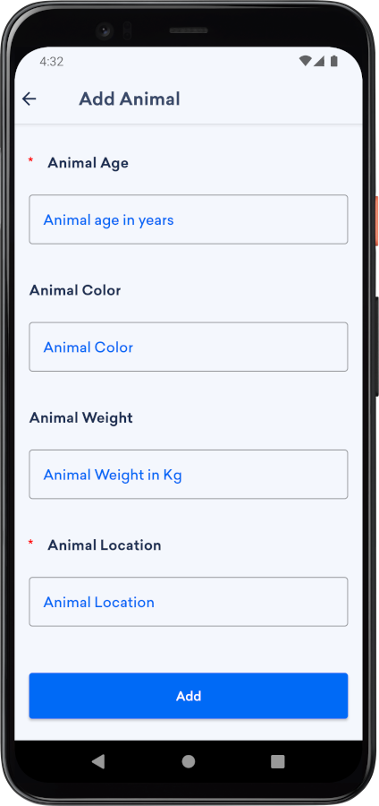

Wiggy -  Android pets app

<b>Overview</b>

Have you ever wanted to get a friend not like any regular friend? Have you ever been so eager to adopt a pet? Or on the contrary, have you ever wanted to spread the cuteness of your pet to other people? This app is the right choice for you. With Wiggy, a beautiful pets adoption app, you can find the right friend for you, get in touch with its owner and get things done. Or you can put your pet so anyone can enjoy them like you did.

<b>Features</b>
<ul>
	<li>Browse hundreds of pets right from your smartphone.</li>
	<li>Find more details about your favorite pet.</li>  
	<li>Contact the owner directly from the app.</li>
	<li>Put your own pet as well so anyone can see them.</li>  
	<li>Android 12 Compatible app</li>
 	<li>Easily customizable</li>
  	<li>Clean Kotlin code</li>
</ul>

